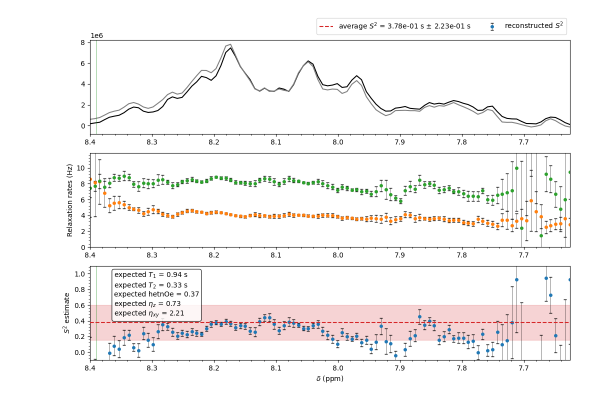

.. _sec;tract:

The ``tract`` subcommand
************************

Standard use
============

This subcommand fits a TRACT experiment and extracts the  correlation time of the system either averaged if the flag `--integrate` is used, or across the spectrum. 
It uses the algebraic analysis described in `Robson et al. (2021)`_, and that is available on GitHub as `nomadiq/TRACT_analysis`_.
    
.. _Robson et al. (2021): https://doi.org/10.1007/s10858-021-00379-5
.. _nomadiq/TRACT_analysis: https://github.com/nomadiq/TRACT_analysis/tree/master

The script is invoked as:
::

    t1t2ne tract --basedir <basedir> --tract <TRACT experiment number> --integrate

The TRACT experiment to analyzed is interpreted to be in the `<basedir>/<TRACT experiment number>` directory.

.. note::

    The user `must` provide the experiment number of the TRACT experiment. If not provided, the software will look for the configuration file. 
    If it is not found, it will fall back on the `examples` directory.
    
The algorithm works as follows.

-   The software will load the spectrum and process it.
-   phase it using the interactive phasing GUI (see :func:`klassez.processing.interactive_phase_1D`).
    -   If the flag `--integrate` is used, the user will be prompted to select the region of the spectrum to be integrated using the interactive integration GUI (see :func:`klassez.anal.integrate`).  
    -   Else, the software will select the region of the spectrum to be fitted. 
        -   using the flag `--selectregion` the user will be prompted to select it using the interactive integration GUI (see :func:`klassez.fit.get_region`).
        -   else, the software will select the NH region of the spectrum to be fitted ([8.6, 7.4] ppm for idps and [10, 7] ppm for globular proteins). 
-   The decay curves obtained from the integrated regions are then fitted to extract the relaxation rates of the TROSY and the AntiTROSY components.
-   The rates are subtracted to extract the cross-correlation rate, and the correlation time is extracted from it using the algebraic analysis described in `Robson et al. (2021)`_. 
-   The values can be visualized as function of the position in the spectrum by providing the ``--plot`` argument.

For ubiquitin at 600 MHz, the call is, for instance

::

    t1t2ne tract --basedir <basedir> --tract <TRACT experiment number> --selectregion --plot

---

The results are shown in the following figure.

.. figure:: _static/tract_ubiquitin.png
    :name: tract_ubiquitin
    :width: 80.0%

    The result of the TRACT analysis for ubiquitin at 600 MHz in the ``--selectregion`` mode. The raw data are provided in the ``examples`` directory.

The IDP option
==============

At variance with the original paper (`Robson et al. (2021)`_), we foresee the use for Intrinsically Disordered Proteins (IDPs). 
When the ``--idp`` option is used, the software will **NOT** compute the correlation time but the order parameter :math:`S^2_{int}` of the intermediate motion. 
    
In this case the call is, for instance for synuclein at 600 MHz:
::

    t1t2ne tract --basedir <basedir> --tract <TRACT experiment number> --idp --MW 14.4 --selectregion --plot

The results are shown in the following figure.

    The result of the TRACT analysis for the IDP synuclein at 600 MHz in the ``--selectregion`` mode. The raw data are provided in the ``examples`` directory.

At the end of the analysis, the software provides the command to generate the lists for running T\ :sub:`1`\  and T\ :sub:`2`\  experiments based on the obtained correlation time.

.. rubric:: Examples

**TODO** da popolare

.. rubric:: TODO

Non si capisce dove parli di IDP e dove no. Popola la sezione *Esempi* spostando i pezzi dove invochi il codice e spieghi a cosa serve cosa. Nel testo principale lascia la teoria e i risultati generali.

